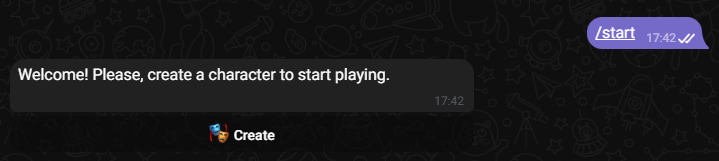
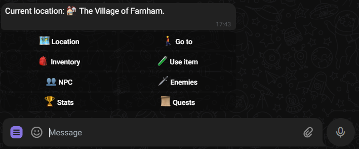
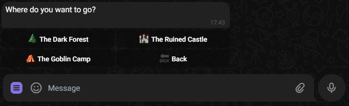
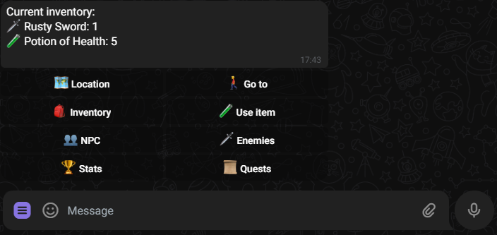
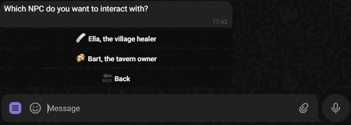

## About

This is a text-based adventure game in a form of a telegram bot where you can explore a fantasy world of magic and mystery. You can visit different locations, meet and talk to different characters, accept and complete quests, fight enemies and collect items. The game is very small, but it should be fun and challenging. You can play it multiple times with different results.

The base code of the bot is from my another repository [scp_python_bootcamp](https://github.com/AlexeyGordiychenko/scp_python_bootcamp/blob/main/Team01/README.md) but this implementation uses webhooks instead of polling.

You can test my bot [here](https://t.me/rpg_adventure_python_bot)

## Technology Stack

- 🐍 [Python](https://www.python.org/) programming language
- 🤖 [aiogram](https://aiogram.dev/) asynchronous framework for Telegram Bot API
- 💾 [SQLite](https://www.sqlite.org/) as the SQL database
- 🚀 [FastAPI](https://fastapi.tiangolo.com/) to handle webhooks
- ⚡️ [UV](https://github.com/astral-sh/uv) package manager

## Project structure
```
.
├── api             # FastAPI app for webhooks
├── bot             # Bot's logic
│   ├── handlers.py # Bot's handlers
│   ├── kb.py       # Bot's keyboards
│   ├── msg_text.py # Bot's messages
├── config.py       # Various configs (token, urls, paths, etc.)
├── db              # Database logic
│   ├── data        # Json files for initial load
│   ├── db.py       # Database models
│   ├── load_all.py # Script for initial load
│   └── utils.py    # Database utils
├── main.py         # Bot's entry point
├── pyproject.toml  # UV config
└── uv.lock         # UV lock file
```

## How to run

Create a telegram bot for the game. Open [@BotFather](https://t.me/BotFather) and follow the instructions to create a new bot.

Create .env file with your bot token and webhook url
```
BOT_TOKEN=
BASE_URL=
```
`BOT_TOKEN` is provided by [@BotFather](https://t.me/BotFather).

`BASE_URL` is the url for webhooks, you can use [localtunnel](https://localtunnel.github.io/www/) to get a public url.

Optionally you can set `ADMIN_ID` with your telegram id to receive notifications when the bot is started and stopped.

Make sure you have [UV](https://github.com/astral-sh/uv) installed and run `uv run main.py`

## How to play

Please refer to the [game instructions](GAME.md)

## Screenshots









